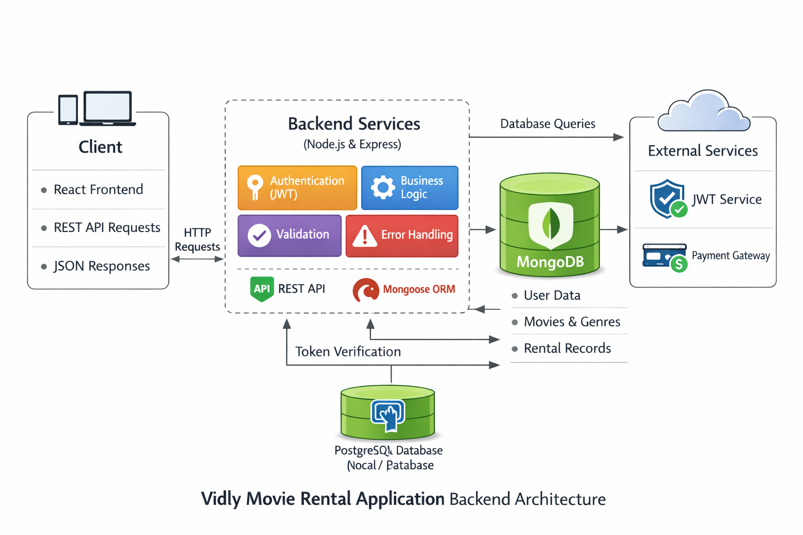

Node.js + Express + MongoDB + JWT architecture
Production deployment on Render

Vidly – Movie Rental Backend API

**Live API**:[https://vidly-movierental-app.onrender.com](https://vidly-movierental-app.onrender.com)

Vidly is a production-ready Movie Rental Backend built using **Node.js, Express, and MongoDB**, implementing secure authentication, modular architecture, and scalable RESTful design principles.

System Architecture



> Save the generated architecture image as `architecture.png` in the root folder before pushing to GitHub. **Paste image here--**


---

Architecture Overview

The application follows a **Layered REST Architecture** with clear separation of concerns:

```
Client → Express API → Middleware → Business Logic → Mongoose ORM → MongoDB
```

It is designed to be:

* Modular
* Secure
* Scalable
* Maintainable
* Industry-aligned

---

1.**Client Layer**

The client can be:

* React Frontend
* Postman
* Any REST API consumer

**Responsibilities:**

* Sends HTTP requests
* Receives JSON responses
* Stores JWT token for authenticated routes

---

2. **API Layer (Express Server)**

Handles:

* Route definitions
* Request parsing
* Response formatting
* RESTful endpoint management

### Core API Endpoints

```
/api/users       → User registration
/api/auth        → Login & JWT generation
/api/movies      → Movie CRUD
/api/genres      → Genre CRUD
/api/customers   → Customer management
/api/rentals     → Rental processing
```

---

3. **Middleware Layer** 

Middleware ensures validation, security, and centralized error handling.

🔐 Authentication Middleware

* Verifies JWT token
* Protects private routes

🛡 Authorization Middleware

* Admin-only route access
* Role-based access control

**Validation Middleware**

* Joi schema validation
* Prevents invalid payloads

🚨 **Error Handling Middleware**

* Centralized error handling
* Prevents stack trace exposure in production

---

4. **Business Logic Layer**

Implements domain-specific logic.

🎬 Movies

* Add new movie
* Update stock
* Delete movie

🎭 Genres

* Create and manage genres

👤 **Users**

* Register users
* Hash passwords using bcrypt
* Generate JWT token

📦 **Rentals**

* Validate customer
* Validate movie availability
* Create rental record
* Decrease movie stock
* Handle atomic operations

---

5. **Data Access Layer** (Mongoose ORM)

Responsible for:

* Schema definitions
* Model creation
* Database queries
* CRUD operations

### Core Collections

* Users
* Movies
* Genres
* Customers
* Rentals

---

6. **Database Layer**

### MongoDB (Cloud / Local)

Stores:

* User credentials (hashed)
* Movie inventory
* Rental transactions
* Customer records

Database accessed via **Mongoose ORM**.

---

🔐 **Authentication Flow** (JWT Based)

1. User registers
2. Password hashed using bcrypt
3. User logs in
4. JWT token generated
5. Token sent in request header:

```
x-auth-token: <JWT_TOKEN>
```

6. Middleware verifies token
7. Access granted to protected routes

✔ Stateless Authentication
✔ No session storage required
✔ Horizontally scalable

---

🔄 **Rental Transaction Flow**

```
Client → POST /api/rentals
        ↓
Validate customer
        ↓
Validate movie
        ↓
Check stock
        ↓
Create rental record
        ↓
Decrease movie stock
        ↓
Return JSON response
```

---

🔁 **Request Lifecycle**

```
Client Request
      ↓
Express Router
      ↓
Authentication Middleware
      ↓
Validation Middleware
      ↓
Controller Logic
      ↓
Mongoose ORM
      ↓
MongoDB
      ↓
JSON Response
```

---

🛡 **Security Architecture**

✔ JWT-based stateless authentication
✔ Password hashing (bcrypt)
✔ Role-based authorization
✔ Input validation (Joi)
✔ Environment variable configuration
✔ Centralized error handling
✔ Production-safe error abstraction

---

📂 **Project Structure** 

```
vidly/
│
├── startup/          # App configuration
├── routes/           # API routes
├── models/           # Mongoose schemas
├── middleware/       # Auth & validation
├── config/           # Environment config
├── index.js          # Entry point
└── package.json
```

---

🚀 **Deployment Architecture**

* Hosted on: Render
* Node.js production server
* MongoDB Atlas (cloud database)
* Environment variables secured
* REST API exposed publicly

---

🧠 **Architectural Patterns Used**

✔ Layered Architecture
✔ RESTful API Design
✔ MVC-inspired structure
✔ Stateless Authentication
✔ Modular codebase
✔ Separation of concerns

---

📈 **Scalability Considerations**

* Stateless JWT authentication
* Cloud-hosted database
* Easy horizontal scaling
* Middleware extensibility
* Future-ready for microservices transition

---

🎯 **Why This Architecture?**

* Clean separation of responsibilities
* Interview-ready backend design
* Production-grade security
* Maintainable and scalable structure
* Real-world backend engineering practices

---
